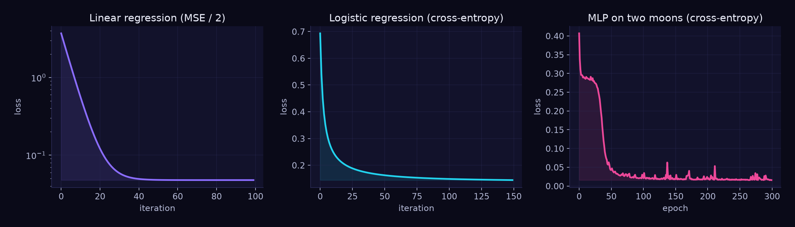
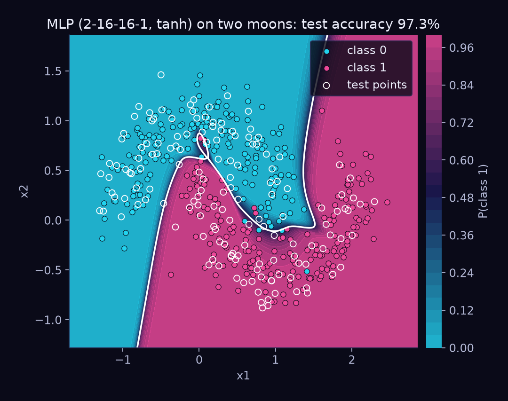
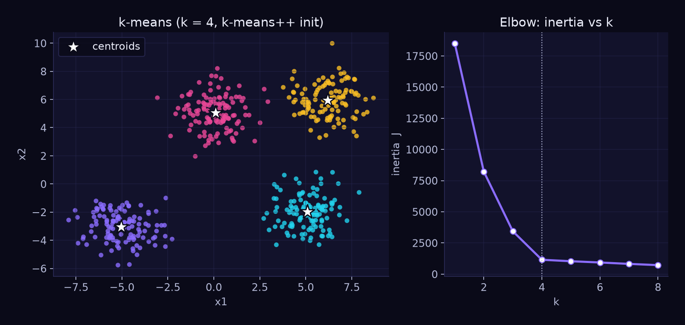
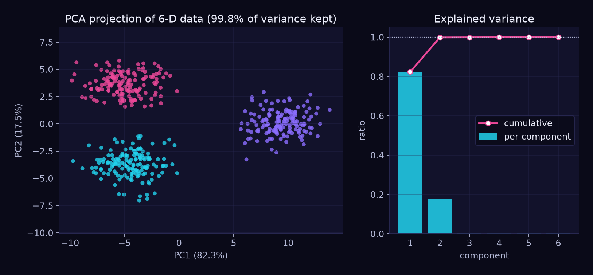
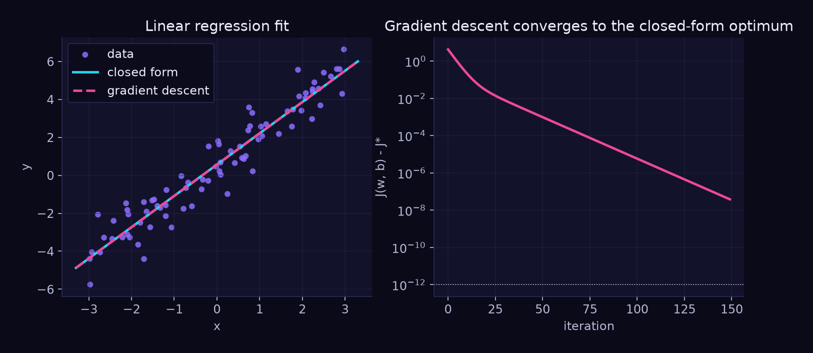
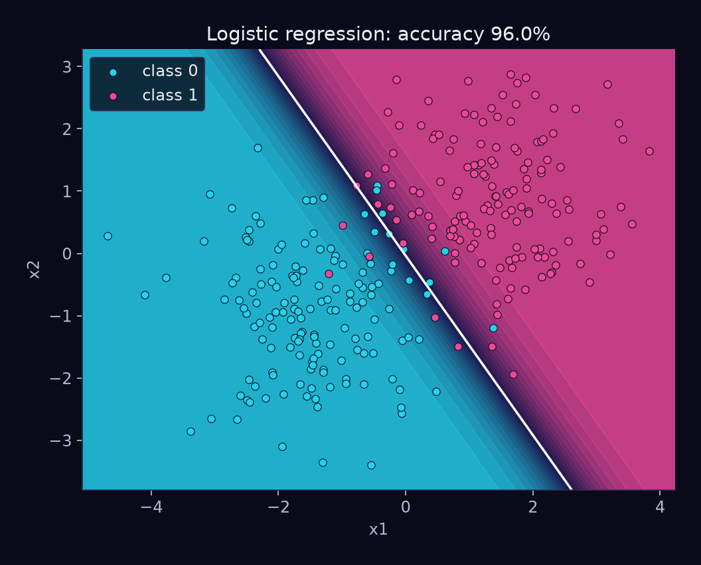

# ml-from-scratch

[](https://github.com/Shirenos/ml-from-scratch/actions/workflows/ci.yml)


[](https://docs.astral.sh/ruff/)
[](LICENSE)

Classic machine-learning algorithms written **from scratch in plain NumPy**: no scikit-learn,
no autograd, no magic. Every algorithm is a small, readable class with its maths in the
docstring, type hints, and tests that check it against analytical results and (as a
development-only dependency) against scikit-learn.

| Algorithm | Class | Trained by |
| --- | --- | --- |
| Linear (and ridge) regression | `LinearRegression` | normal equations **or** gradient descent |
| Binary logistic regression | `LogisticRegression` | gradient descent on cross-entropy |
| Multilayer perceptron | `MLP` | hand-written backpropagation, SGD / Adam |
| k-means | `KMeans` | Lloyd's algorithm + k-means++ seeding |
| PCA | `PCA` | SVD of the centred data matrix |

Matplotlib is only used for the plots in `examples/` (optional `plots` extra).

## Quickstart

```bash
git clone https://github.com/Shirenos/ml-from-scratch.git
cd ml-from-scratch
python -m venv .venv && source .venv/bin/activate
pip install -e ".[dev]"      # numpy + matplotlib + pytest, ruff, mypy, scikit-learn
pytest                       # run the tests
python examples/mlp_decision_boundary.py   # regenerate a plot into docs/
```

```python
import numpy as np
from ml_from_scratch import MLP, PCA, KMeans, LinearRegression, LogisticRegression
from ml_from_scratch import make_moons, make_blobs, train_test_split

# linear regression: closed form or gradient descent
X = np.random.default_rng(0).normal(size=(100, 3))
y = X @ [1.0, -2.0, 0.5] + 3.0
LinearRegression().fit(X, y).coef_  # ~ [1, -2, 0.5]
LinearRegression("gradient_descent", learning_rate=0.1, n_iter=500).fit(X, y)

# a small neural network on two moons
X, y = make_moons(500, noise=0.2, random_state=0)
X_tr, X_te, y_tr, y_te = train_test_split(X, y, random_state=0)
mlp = MLP((16, 16), learning_rate=0.02, n_epochs=300, batch_size=64).fit(X_tr, y_tr)
print(mlp.score(X_te, y_te))  # ~ 0.94

# clustering and dimensionality reduction
labels = KMeans(3, random_state=0).fit_predict(make_blobs(300, 3, random_state=1)[0])
Z = PCA(2).fit_transform(np.random.default_rng(0).normal(size=(200, 5)))
```

All estimators follow the familiar `fit` / `predict` / `score` (or `transform`) interface and
expose learned values with a trailing underscore (`coef_`, `loss_history_`, `cluster_centers_`, ...).

## Math notes

Notation: $n$ samples, $d$ features, data matrix $X \in \mathbb{R}^{n\times d}$, targets $y$.

### Linear regression &mdash; [`linear_regression.py`](src/ml_from_scratch/linear_regression.py)

Model $\hat y = Xw + b$ with objective $J(w,b)=\frac{1}{2n}\lVert Xw+b-y\rVert^2+\frac{\lambda}{2}\lVert w\rVert^2$.

* **Closed form**: setting $\nabla J=0$ gives the normal equations
  $(X^\top X + n\lambda I)\,w = X^\top y$ (on centred data; $b=\bar y-\bar x^\top w$).
  For $\lambda=0$ we use an SVD-based least-squares solver instead of inverting $X^\top X$.
* **Gradient descent**: with residual $r=Xw+b-y$,
  $\nabla_w J=\frac1n X^\top r+\lambda w$, $\nabla_b J=\frac1n\sum_i r_i$, and $w\leftarrow w-\eta\nabla_w J$.
  $J$ is a convex quadratic, so GD converges to the closed-form solution.

### Logistic regression &mdash; [`logistic_regression.py`](src/ml_from_scratch/logistic_regression.py)

$P(y=1\mid x)=\sigma(w^\top x+b)$, $\sigma(z)=1/(1+e^{-z})$. Minimising the mean negative log-likelihood

$$J(w,b)=\frac1n\sum_i\big[\log(1+e^{z_i})-y_iz_i\big]+\frac\lambda2\lVert w\rVert^2,\qquad z_i=w^\top x_i+b$$

has the gradient $\nabla_w J=\frac1n X^\top(\sigma(z)-y)+\lambda w$. $J$ is convex, so gradient
descent finds the global optimum. `softplus` / `sigmoid` are implemented in a numerically stable way.

### Multilayer perceptron &mdash; [`mlp.py`](src/ml_from_scratch/mlp.py)

Forward pass $z^{(l)}=a^{(l-1)}W^{(l)}+b^{(l)}$, $a^{(l)}=\phi(z^{(l)})$ with $\phi\in\{\tanh,\mathrm{ReLU}\}$.
The output link matches the loss (sigmoid + cross-entropy, softmax + cross-entropy, identity + squared error),
and for all three pairs the output error is simply $\delta^{(L)}=(a^{(L)}-y)/n$. Backpropagation applies the chain rule:

$$\delta^{(l-1)}=\big(\delta^{(l)}W^{(l)\top}\big)\odot\phi'(z^{(l-1)}),\qquad
\frac{\partial J}{\partial W^{(l)}}=a^{(l-1)\top}\delta^{(l)}+\lambda W^{(l)},\qquad
\frac{\partial J}{\partial b^{(l)}}=\sum_i\delta^{(l)}_i$$

Training minimises $J=\frac1n\sum_i\ell_i+\frac{\lambda}{2}\sum_l\lVert W^{(l)}\rVert_F^2$. On a mini-batch the data
term is the batch *mean* while the penalty keeps its full weight $\lambda W$, so every batch gradient is an unbiased
estimate of $\nabla J$ and the strength of `l2` does not depend on `batch_size` (a test checks that the average
gradient over an epoch of equal batches equals the full-batch gradient for several batch sizes).

The tests verify every gradient against **central finite differences**. Weights use Glorot (tanh) or He (ReLU)
initialisation; optimisers are plain SGD and Adam, with optional gradient clipping by global norm (`clip_norm`).

### k-means &mdash; [`kmeans.py`](src/ml_from_scratch/kmeans.py)

Minimise the inertia $J=\sum_i\lVert x_i-\mu_{c_i}\rVert^2$ by alternating
**assign** ($c_i=\arg\min_k\lVert x_i-\mu_k\rVert^2$) and **update** ($\mu_k=$ mean of cluster $k$) steps; neither
step can increase $J$, so the algorithm converges to a local minimum. **k-means++** seeding picks each new centre
with probability $\propto D(x)^2$ (squared distance to the nearest chosen centre), and the best of `n_init` runs is kept.

### PCA &mdash; [`pca.py`](src/ml_from_scratch/pca.py)

With centred data $X_c$, the principal axes are the eigenvectors of the covariance
$C=\frac1{n-1}X_c^\top X_c$. We use the thin SVD $X_c=USV^\top$ instead: rows of $V^\top$ are the axes,
variances are $\lambda_j=s_j^2/(n-1)$, the projection is $Z=X_cV_k$, and $ZV_k^\top+\bar x$ is the best rank-$k$
reconstruction (Eckart&ndash;Young). Component signs are normalised so results are deterministic.

## Plots

All figures are generated by the scripts in [`examples/`](examples) with a dark indigo / violet / cyan
matplotlib style (`ml_from_scratch.plotting.apply_universe_style`).

| | |
| --- | --- |
| **Loss curves** (`loss_curves.py`)<br> | **MLP decision boundary on two moons** (`mlp_decision_boundary.py`)<br> |
| **k-means clusters + elbow curve** (`kmeans_clusters.py`)<br> | **PCA projection** (`pca_projection.py`)<br> |
| **Linear regression: closed form vs GD** (`linear_regression_fit.py`)<br> | **Logistic regression boundary** (`logistic_regression_boundary.py`)<br> |

## Testing and quality

* `pytest` &mdash; analytical results (normal equations, eigendecomposition of the covariance, Eckart&ndash;Young
  residual), numerical gradient checks for backprop, and comparisons with scikit-learn
  (`Ridge`, `LogisticRegression`, `KMeans`, `PCA`). The scikit-learn tests are skipped automatically if it is
  not installed; it is a *development* dependency only.
* `ruff check` / `ruff format --check` and `mypy --strict` are clean.
* GitHub Actions runs lint, type checks, tests and all example scripts on Python 3.11, 3.12 and 3.13.

## Project structure

```
ml-from-scratch/
├── src/ml_from_scratch/
│   ├── linear_regression.py      # closed form + gradient descent (+ ridge)
│   ├── logistic_regression.py    # binary logistic regression
│   ├── mlp.py                    # MLP with backprop, SGD/Adam
│   ├── kmeans.py                 # Lloyd + k-means++
│   ├── pca.py                    # PCA via SVD
│   ├── datasets.py               # make_moons, make_blobs, train_test_split
│   ├── plotting.py               # "Universe" matplotlib style helpers
│   └── _utils.py                 # validation, stable sigmoid / softmax, R^2
├── tests/                        # pytest suite
├── examples/                     # scripts that generate the plots in docs/
├── docs/                         # generated PNGs
└── .github/workflows/ci.yml
```

## License

[MIT](LICENSE)
